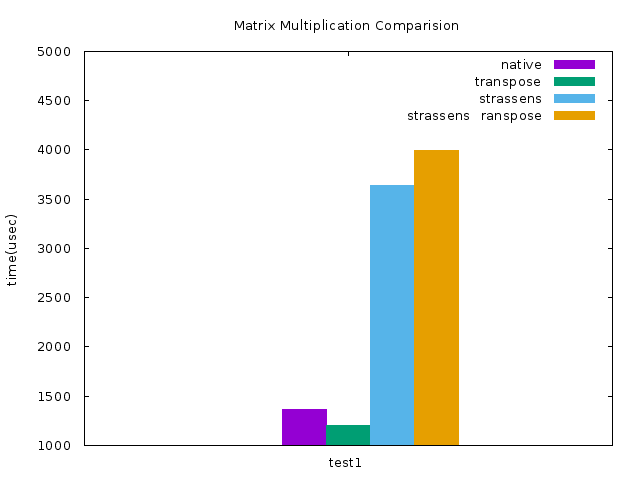
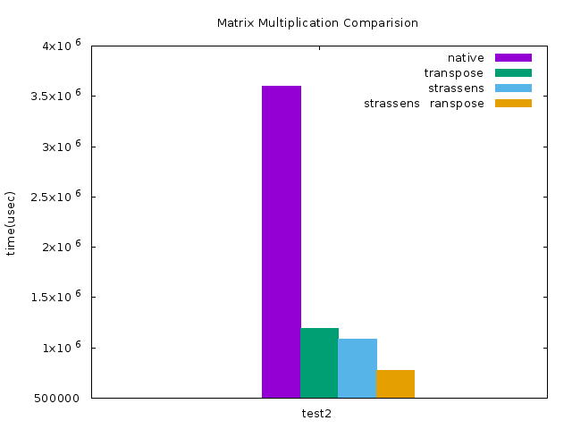
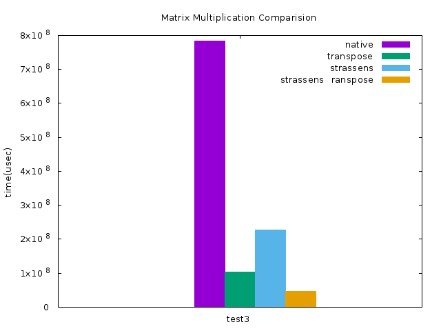

# Matrix Multiplication

Four different versions of matrix multiplication

- traditional matrix multiplication with 
    - openMP speed up
- traditional matrix multiplication with
    - openMP speed up
    - transpose speed up
    - AVX speed up
    - prefetch speed up
- strassens matrix multiplication with
    - openMP speed up
- strassens matrix multiplication with
    - openMP speed up
    - transpose speed up
    - AVX speed up
    - prefetch speed up

## Getting Started

Execute 
```
$ make all
```
to compile 

- ```native_parallel_multiplication```
    - openMP speed up
- ```strassens_parallel_multiplication```
    - openMP speed up
    - transpose speed up
    - AVX speed up
    - prefetch speed up
- ```transpose_native_parallel_multiplication```
    - openMP speed up
- ```transpose_strassens_parallel_multiplication```
    - openMP speed up
    - transpose speed up
    - AVX speed up
    - prefetch speed up

## Run
To execute the matrix multiplication,
```
$ matrix_multiplication < <input_data>
```
then the multiplication result ```<matrix_multiplication>.output``` and the execution time will be generated.

## Input data format

There are some examples in folder ```test_data```.


## Benchmarking
To do the benchmarks, 
```
$ sh run.sh
```

### 10 * 10

### 1024 * 1024

### 4096 * 4096


## Author
* **Lao Chon Lam** - [laochanlam](https://github.com/PurpleBooth)
* **etc276** - [etc276](https://github.com/etc276)
* **Cayon Liow** - [cayonliow](https://github.com/Cayonliow)